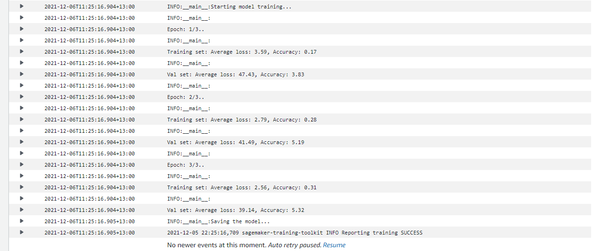

# Image Classification using AWS SageMaker

Use AWS Sagemaker to train a pretrained model that can perform image classification by using the Sagemaker profiling, debugger, hyperparameter tuning and other good ML engineering practices. This can be done on either the provided dog breed classication data set or one of your choice.

## Project Set Up and Installation
Enter AWS through the gateway in the course and open SageMaker Studio. 
Download the starter files.
Download/Make the dataset available. 

## Dataset
The provided dataset is the dogbreed classification dataset, which contains images from 133 dog breeds divided into training, testing, and validation.

### Access
Upload the data to an S3 bucket through the AWS Gateway so that SageMaker has access to the data. 

## Hyperparameter Tuning
For this project, I decided to use the pretrained Alexnet model. I added to the final classification layer 4 FC layers with respectively 750, 500, 250 and 133 neurons.
I used the sagemaker hyperparameter tuning function (based on bayesian optimisation) to find the best combination of learning-rate/batch-size.
  
Here is a screenshot of the completed hyperameter tuning job:  


Of the best training job (and its associated parameters):


and it's logs metrics:



## Debugging and Profiling
A machine learning training job can have problems such as system bottlenecks, overfitting, saturated activation functions, and vanishing gradients, which can compromise model performance.  

I used SageMaker Debugger profiles and debugs training jobs to identify such problems. 
**Debuger:** With the help of the SMDebug library, I put an hook on the model to monitor both training and validation metrics.  
**Profiler:** Sagemaker Profiler can be useful for monitoring ressources such as isntance metrics, CPU/GPU utilization and memory. I created rules (thresholds that can trigger "alerts") and passed them to the estimator through a profiler configuration.  


### Results
**Debuger:**

- Training loss: I do think it is normal for the loss to be bit bumpy when evaluated on each batch, especially when it is quite small (batch_size = 16).
- Validation loss: I can't explain the strange shape of the val_crossentropyloss_output, especially when we can clearly see that the val loss is decreasing properly at each epoch (output of the estimator.fit() cell).

Also:  
I think differencing dog breeds requires to focus on very specific features. If I had to aim for a performing model, I will consider finetuning some of the last CNN layers of the model, not just the classification ones.
  
**Profiler:**
The profiler output is available in the "ProfilerReport-1638742481" folder.  
None of the alarms (rules) have been triggered, which means no major issues have been found.


## Model Deployment
I had troubles accessing the default endpoint (generated from the pytorch estimator deploy function). I suspect it had something to do with the SMDebug library.  
  
  
To solve this issue, I created my own inference script.  
In order to finish this project in a timely manner, I focused esclusively on making the endpoint available for what is to me, the most likely "real-world" scenario. In other words, the endpoint had to return a prediction from a raw/unprepared image.  

There is therefore two ways to call the endpoint:
- From a sagemaker notebook: 
```
with open("image_path", "rb") as f:
    payload = f.read()
prediction = predictor.predict(payload, initial_args={"ContentType": "image/png"})
```

- From a lambda function: 
```
with open("image_path", "rb") as f:
        image_data = f.read()

runtime = boto3.Session().client('sagemaker-runtime')

response = runtime.invoke_endpoint(EndpointName = endpoint_name,      # The name of the endpoint we created
                                   ContentType = 'image/png',         # The data format that is expected
                                   Body = image_data)  

prediction = json.loads(response['Body'].read().decode())
```

Here is a screenshot of the deployed endpoint:  

